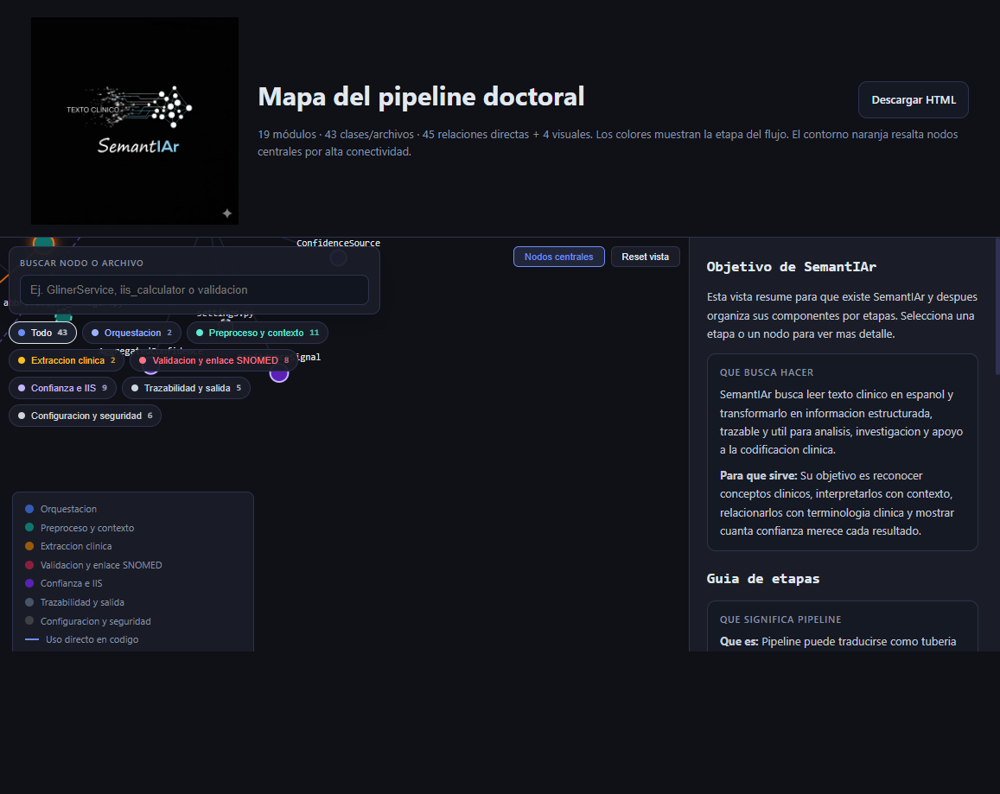

# SemantIAr - Mapa del pipeline doctoral

Visor HTML publico e interactivo del mapa de arquitectura del pipeline doctoral de SemantIAr.

## Ver online

- GitHub Pages: https://manwithbarba.github.io/SemantIAr-mapa-pipeline-doctoral/

## Descargar

- Archivo HTML directo: [doctoral-pipeline.html](doctoral-pipeline.html)
- Entrada del sitio: [index.html](index.html)

## Que incluye

- Grafo interactivo con nodos, relaciones directas y conexiones conceptuales.
- Panel lateral con explicaciones de etapas, componentes y ejemplos de uso.
- Archivo autosuficiente: no depende de recursos externos para abrirse.

## Uso local

1. Descarga `doctoral-pipeline.html` o `index.html`.
2. Abre el archivo en Chrome, Edge o cualquier navegador moderno.

## Alcance del repositorio

Este repositorio contiene solo la version publica del visor estatico para compartir y visualizar el mapa del pipeline doctoral.
